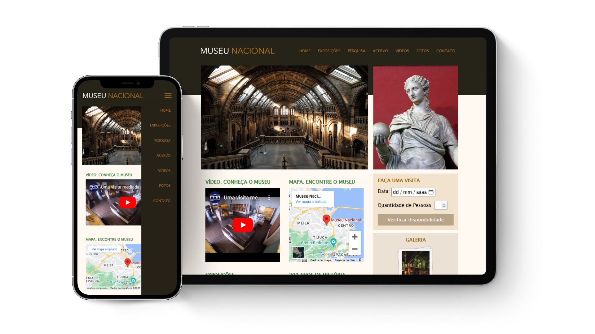

<h1 align="center">
    
</h1>

<h3 align="center">
    <a href="https://gabrielfonsecadev.github.io/MuseuNacional/" target="_blank">Acesse o projeto finalizado aqui!</a>
<h3>

## Sobre 📌
Este é um site para o Museu Nacional. 🏛️  
O site é completamente responsivo! 📱

### Linguagens utilizadas 🧑🏽‍💻
- HTML  
- CSS  
- JS